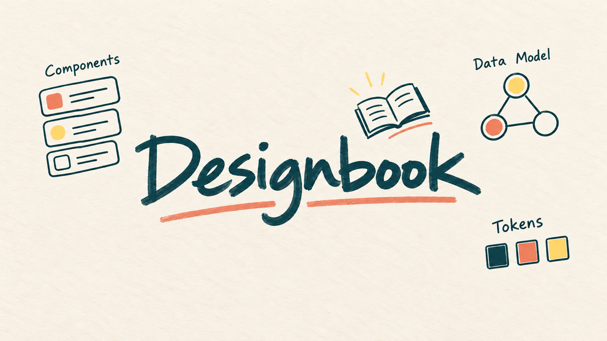
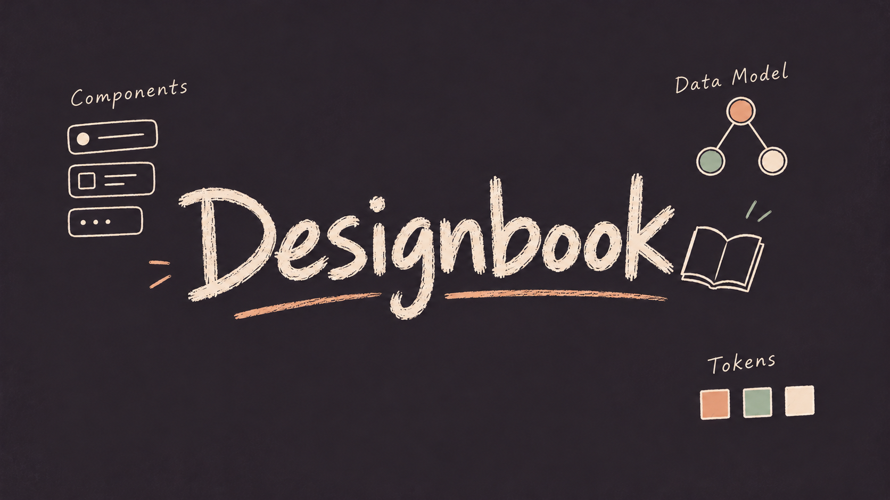

# Designbook key visuals

Only the last two variants are retained: reduced surrounding graphics on light paper and a dark background.

## Light

## Dark

## AC-1 direction candidates

The six earlier mark studies (three directions × imagegen and Seedream) are on [ac1-candidates.png](ac1-candidates.png). They are not the selected logo. The production wordmark lives in [../logo/](../logo/).

Standalone SVG wordmarks: [../logo/](../logo/).
