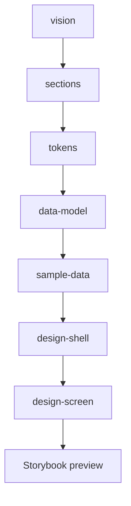

# The pipeline

The default structuring path is vision → sections → tokens → data model → sample data → shell → screens. Each name is a workflow. Additional workflows support that path; they are not extra mandatory stages.

Accessible sequence: vision, then sections, then tokens, then data-model, then sample-data, then design-shell, then design-screen, then inspect the result in Storybook.

## What each stage writes

| Workflow | Typical output |
|---|---|
| `vision` | `vision.yml` product intent |
| `sections` | section definitions from the vision |
| `tokens` | `design-tokens.yml` |
| `data-model` | `data-model.yml` entities, bundles, fields |
| `sample-data` | per-bundle sample files with `__designbook.section` tags |
| `design-shell` | application chrome (header, footer, shared navigation) |
| `design-screen` | a named section screen and its scenes |

`css-generate` compiles tokens into CSS when a CSS framework is selected. `design-component` and `design-entity` create components and entity view modes as the screens need them. `extract-reference` freezes a visual source. `design-verify` scores Storybook against that reference. `sync-verify` reconciles a backend render against Storybook. `sync-to` exports Drupal config YAML. `import` brings in a full design system. `sb` manages the Storybook process.

First use does not require running every row. [Run one workflow](/get-started/first-workflow) is enough to see the pattern. Extend and integrations change which tasks appear inside a stage; they do not replace this sequence.
