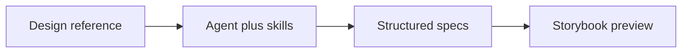

Designbook is not a design tool. Existing design tools stay the input. The agent runs guided skills. Storybook previews the resulting artifacts.

Open [Get started](/get-started/) for the AI-led path, or the [manual](/manual) for the four areas.
